# AI Act Compliance Manager

## 📌 Descripción

**AI Act Compliance Manager** es un software de gestión de cumplimiento diseñado para ayudar a las organizaciones a:
- Clasificar sus sistemas de inteligencia artificial según el **EU AI Act** (riesgo inaceptable, alto, limitado o mínimo).
- Generar y mantener la **documentación obligatoria** (expediente técnico, declaración de conformidad, reportes de incidentes).
- Coordinar equipos multidisciplinares (IA, legal, compliance, seguridad, negocio) en torno a flujos de trabajo claros.
- Garantizar la **trazabilidad, transparencia y gobernanza** de los sistemas de IA.
- Facilitar la interacción con el **Registro Europeo de Sistemas de IA de Alto Riesgo** (cuando la Comisión habilite APIs).

---

## 🎯 Objetivos principales

- Reducir la complejidad regulatoria para proveedores, importadores, distribuidores y usuarios de IA.
- Centralizar documentación técnica y de conformidad.
- Automatizar flujos de revisión y aprobación.
- Proporcionar un **dashboard de cumplimiento en tiempo real**.
- Preparar a la empresa para auditorías y supervisiones regulatorias.

---

## 🏛️ Arquitectura funcional

```mermaid
flowchart LR
  subgraph ORG["Identidad & Organización"]
    A1[Rol de empresa]
    A2[Usuarios & permisos]
    A3[Matriz RACI]
  end

  subgraph INV["Inventario de Sistemas"]
    B1[Catálogo de IA]
    B2[Mapa de despliegues]
    B3[Ciclo de vida]
  end

  subgraph RISK["Evaluación de Riesgo"]
    C1[Cuestionario guiado]
    C2[Motor de reglas]
    C3[Justificación]
  end

  subgraph DOCS["Documentación"]
    D1[Plantillas dinámicas]
    D2[Asistente IA]
    D3[Versionado]
  end

  subgraph WF["Flujos de trabajo"]
    E1[Tareas periódicas]
    E2[Recordatorios]
    E3[Aprobaciones]
  end

  subgraph MON["Monitorización"]
    F1[Logs & evidencias]
    F2[Gestión incidentes]
    F3[Alertas]
  end

  subgraph REP["Reporting"]
    G1[Dashboard KPIs]
    G2[Exportadores]
    G3[Auditoría externa]
  end

  subgraph INT["Integraciones"]
    H1[Jira / Azure DevOps]
    H2[GitHub / GitLab]
    H3[MLOps / DVC]
    H4[SIEM / Seguridad]
    H5[Registro UE]
  end

  ORG --> INV
  INV --> RISK
  RISK --> DOCS
  DOCS --> WF
  WF --> MON
  MON --> REP
  DOCS <---> INT
  MON <---> INT
```



---

## 📂 Módulos principales

1. **Organización & Roles**
   - Identificación del rol (proveedor, importador, distribuidor, usuario).
   - Gestión de permisos y matriz RACI.

2. **Inventario de sistemas**
   - Catálogo centralizado de sistemas de IA.
   - Ciclo de vida (entrenamiento, despliegue, reentrenos).

3. **Evaluación de riesgo**
   - Cuestionario guiado basado en Anexo III del AI Act.
   - Motor de reglas que asigna riesgo.
   - Justificación documentada.

4. **Documentación**
   - Plantillas dinámicas (Expediente técnico, Declaración de Conformidad, Reporte de incidentes).
   - Generación asistida por IA.
   - Control de versiones y firmas.

5. **Workflows**
   - Asignación de tareas por sistema y rol.
   - Recordatorios automáticos y alertas de caducidad.
   - Circuito de revisiones y aprobaciones.

6. **Monitorización**
   - Gestión de logs y evidencias.
   - Registro y reporte de incidentes graves.
   - Alertas de cambios en datasets o modelos.

7. **Reporting**
   - Dashboard de cumplimiento por sistema y unidad de negocio.
   - Exportación en PDF, Word, Excel, JSON.
   - Acceso de solo lectura para auditores externos.

8. **Integraciones**
   - Jira/Azure DevOps (gestión de tareas).
   - GitHub/GitLab (versionado de código/modelos).
   - MLOps (MLflow, DVC, W&B).
   - SIEM y seguridad.
   - Registro europeo de alto riesgo (API futura).

---

## 📊 Modelo de datos (simplificado)

- **Organization, User, Role, RACIAssignment**
- **AISystem** (ámbito, propósito, datasets, despliegues)
- **RiskAssessment** (respuestas, reglas, resultado, justificación, versión)
- **Template, Document** (tipo, versión, firmado)
- **ModelVersion, DatasetVersion** (hash, linaje, licencia)
- **Task, WorkflowRun, Approval**
- **Incident** (tipo, severidad, reporte CE)
- **AuditLog / Evidence**
- **IntegrationConnector**

---

## 🔒 Requisitos no funcionales

- **Seguridad**: IAM, SSO (OIDC/SAML), cifrado, *least privilege*.
- **Trazabilidad**: logs inmutables (WORM).
- **Escalabilidad**: multi-proyecto, multi-tenant.
- **Interoperabilidad**: APIs REST/GraphQL, webhooks.
- **UX**: asistentes paso a paso, estados de cumplimiento, semáforos.

---

## 🚀 Roadmap

- [ ] MVP con identificación de rol, inventario de sistemas y cuestionario de riesgo.
- [ ] Plantillas dinámicas + exportación en PDF/Word.
- [ ] Dashboard de cumplimiento y gestión de incidentes.
- [ ] Integración con Jira/GitLab.
- [ ] API de conexión con Registro UE (cuando esté disponible).
- [ ] Sandbox regulatorio interno para pruebas de IA.

---

## 🛠️ Puesta en marcha del backend (FastAPI)

Sigue estos pasos para levantar el servidor de desarrollo y acceder a la documentación interactiva de la API:

1. **Crea y activa un entorno virtual de Python 3.11+**

   ```bash
   python -m venv .venv
   source .venv/bin/activate  # En Windows: .venv\Scripts\activate
   ```

2. **Instala las dependencias del backend**

   ```bash
   pip install -r backend/requirements.txt
   ```

3. **Arranca el servidor FastAPI con Uvicorn**

   Ejecuta el comando desde la raíz del repositorio para que se resuelvan correctamente los imports relativos:

   ```bash
   uvicorn backend.main:app --reload --host 0.0.0.0 --port 8000
   ```

4. **Abre la documentación interactiva**

   - Documentación Swagger UI: <http://localhost:8000/docs>
   - Documentación alternativa ReDoc: <http://localhost:8000/redoc>

Con `--reload` el servidor se reiniciará automáticamente al detectar cambios en el código.

---

## 📚 Referencias

- [Texto completo del AI Act (2024)](https://artificialintelligenceact.eu/)
- [Explanatory notice & template – Summary of training content for GPAI](https://digital-strategy.ec.europa.eu/en/library/explanatory-notice-and-template-public-summary-training-content-general-purpose-ai-models)
- [ALTAI – Assessment List for Trustworthy AI](https://ec.europa.eu/newsroom/dae/document.cfm?doc_id=68342)
- [ISO/IEC 23894:2023 – AI Risk Management](https://www.iso.org/standard/77304.html)

---
